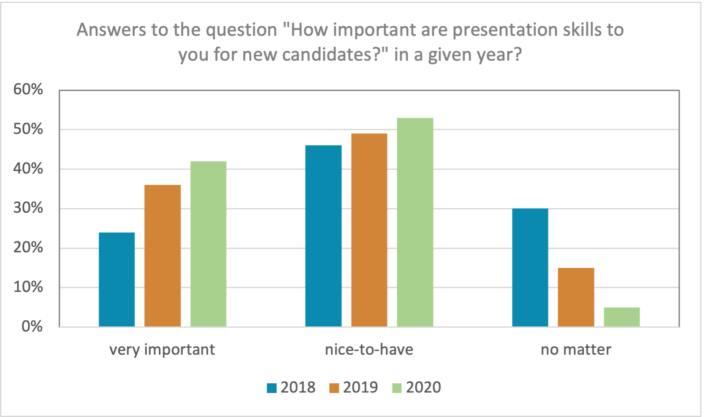
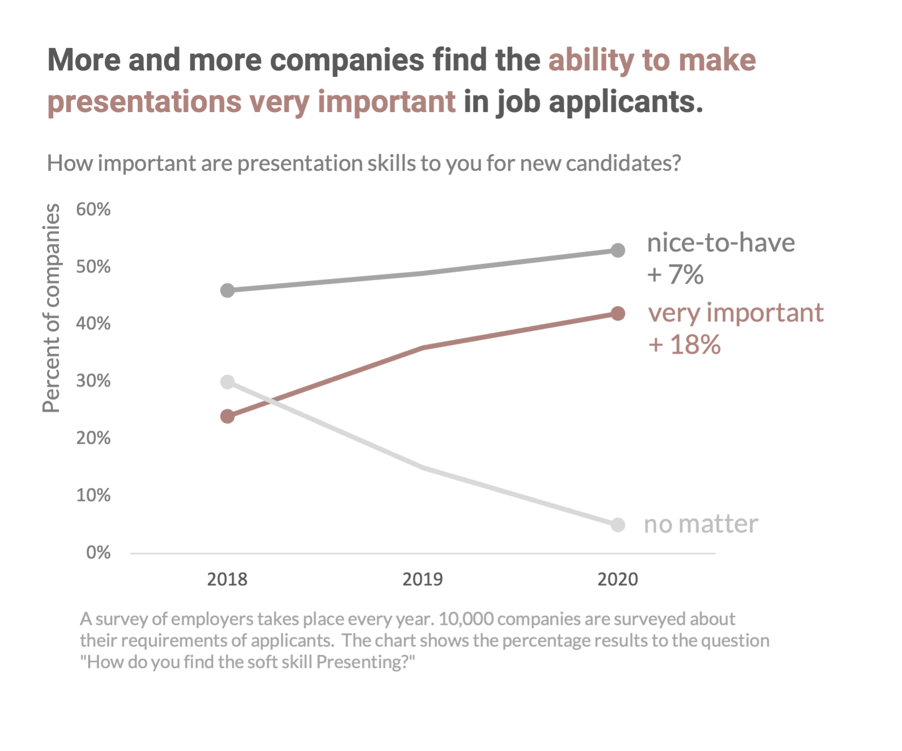

###  Gude (as we say in Mainz, Germany),

 

- 👋🏼 Hi, I’m @RobinBog 

- 👀 I’m the data-loving nature boy 🌱
- 💞️ I am looking for cooperation in projects that are committed to nature and the environment.
- 📫 Just send an [email](mailto:Robin.Bogon@gmx.net)

 

## Data Scientist with a passion for visualization

I'm very curious, and data science helps me understand things better.
 
At the beginning of my Data Science career, it was really not easy for me to create effective diagrams directly in Python. That's a skill you don't learn in a computer science degree.
 
<b>But keeping the results to myself is boring after all.</b> Therefore, I created a process that allowed me to significantly reduce the time between analyses and shared insights.

#### Small example of how the same data can differ in presentation.

##### Before:

##### After:
 

#### Keep improving and help others by sharing your knowledge.
Join our [Data Translator Linkedin community](https://www.linkedin.com/groups/12567001/).

 

And otherwise:
Write me if you want to chat about data, careers, or your vegetable garden.
